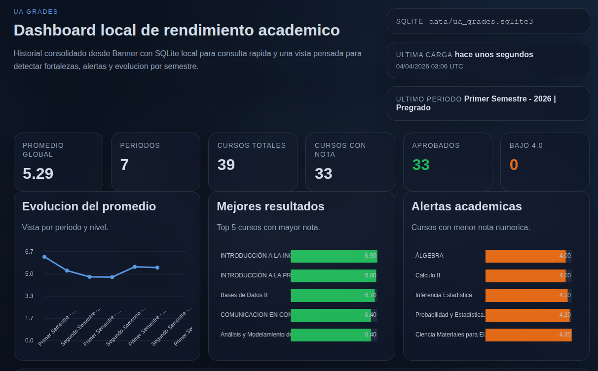

# UA Grades

<p align="center">
  <strong>Historial academico desde Banner + SQLite + dashboard local</strong>
</p>

<p align="center">
  Herramienta personal para extraer tus notas desde Banner, consolidarlas en SQLite y visualizarlas en una web local con metricas, promedios y alertas por semestre.
</p>

<p align="center">
  
</p>

## Resumen

`UA Grades` automatiza el acceso a Banner, recorre todos los periodos disponibles para tu cuenta y construye un historial academico local.

Con ese historial puedes:

- guardar un respaldo en JSON
- persistir la informacion en SQLite
- levantar un dashboard web local
- ver promedios por semestre
- detectar cursos fuertes, cursos mas debiles y periodos sin nota

## Caracteristicas

- Extraccion automatizada con `Playwright`
- Login con Microsoft + `TOTP`
- Historial consolidado de todos los semestres disponibles
- Persistencia local en `SQLite`
- Exportacion a `JSON`
- Dashboard local con metricas y graficos
- Soporte para ejecucion local o con `Docker`

## Flujo

1. `fetch`: inicia sesion y extrae el historial academico desde Banner.
2. Guarda el resultado en `JSON` y `SQLite`.
3. `serve`: levanta la web local leyendo desde SQLite.

## Comandos

```bash
python main.py fetch
python main.py serve
```

El dashboard queda disponible en `http://127.0.0.1:8000`.

## Uso local

```bash
python -m venv .venv
source .venv/bin/activate
pip install -r requirements.txt
python main.py fetch
python main.py serve
```

## Uso con Docker

```bash
cp .env.example .env
docker compose build
docker compose run --rm app python main.py fetch
docker compose up
```

El dashboard queda disponible en `http://localhost:8000`.

Para `fetch` dentro de Docker conviene usar `UA_HEADLESS=true`. Si Microsoft cambia la pantalla de 2FA y necesitas intervenir manualmente, ejecuta `python main.py fetch` fuera del contenedor.

## Variables principales

Copia `.env.example` a `.env` y completa tus credenciales.

- `UA_USUARIO`
- `UA_CONTRASENA`
- `UA_TOTP_SECRET`
- `UA_OUTPUT_DIR`
- `UA_SQLITE_PATH`
- `UA_WEB_HOST`
- `UA_WEB_PORT`

## Archivos generados

- `data/ua_grades.sqlite3`: base SQLite local
- `data/historial_notas_*.json`: exportaciones JSON
- `.auth/ua_profile/`: perfil persistente del navegador

## Como obtener `UA_TOTP_SECRET`

1. Inicia sesion en `https://myaccount.microsoft.com/uac/device-management`.
2. Activar la verificacion de 2 pasos con una aplicacion de Authenticator.
3. Escanea el codigo QR con la aplicacion `Ente Auth`.
4. Obtiene el secreto TOTP desde los detalles del metodo y agregalo a `.env` junto al correo y la contrasena.

## Notas

- El proyecto esta pensado para uso personal y local.
- La web no scrapea en cada refresh; consume el ultimo historial guardado en SQLite.
- Si quieres actualizar tus datos, vuelve a ejecutar `python main.py fetch`.
